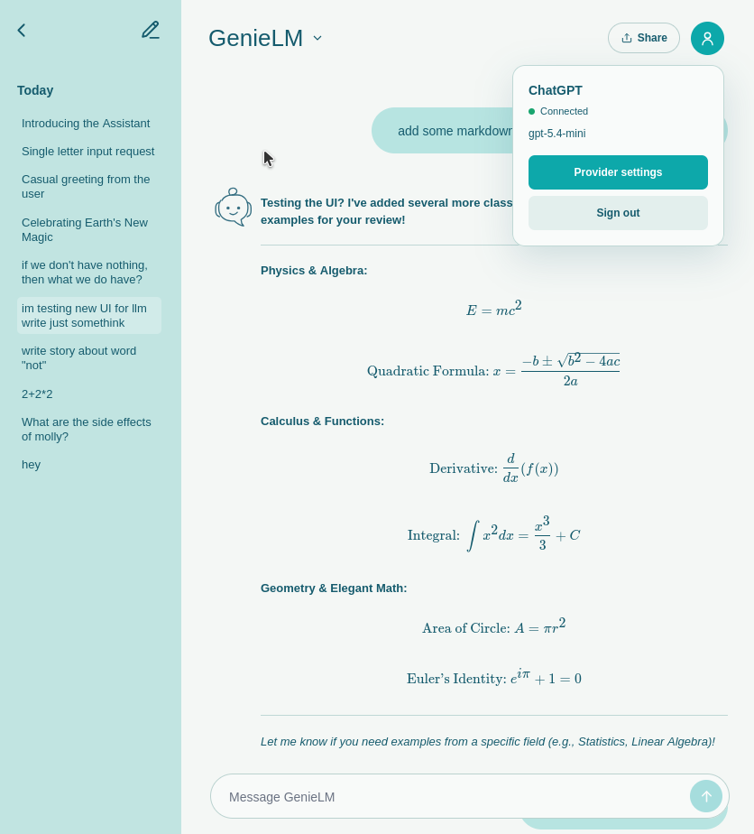
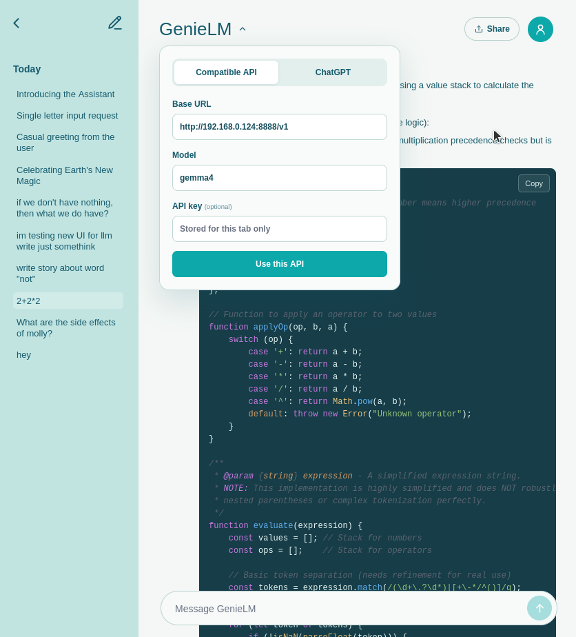
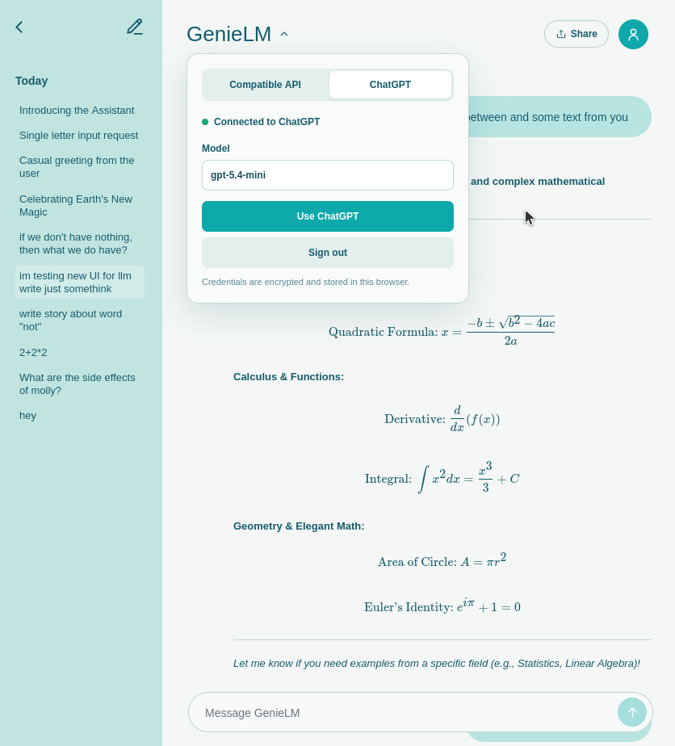

# GenieLM

A small SvelteKit chat client for OpenAI-compatible models and ChatGPT OAuth. Conversations stay in the browser, while responses stream through the app server.



## What it does

- Connects to any OpenAI-compatible base URL and model
- Signs in with ChatGPT through the community-maintained [openai-oauth](https://github.com/EvanZhouDev/openai-oauth) plugin
- Streams responses with stop control
- Saves conversations locally and gives each one an LLM-generated title
- Renders Markdown, highlighted code, copy buttons, tables, and KaTeX
- Shares conversations as Markdown
- Works on desktop and mobile

<table>
  <tr>
    <td width="50%"></td>
    <td width="50%"></td>
  </tr>
  <tr>
    <td align="center">OpenAI-compatible API</td>
    <td align="center">ChatGPT OAuth</td>
  </tr>
</table>

## Run it

```sh
bun install
bun run dev -- --open
```

Open the GenieLM menu in the header before sending your first message.

### OpenAI-compatible API

Enter the base URL, model name, and optional API key. The base URL should include the API prefix, such as `http://localhost:8888/v1`.

### ChatGPT OAuth

Choose ChatGPT and press **Sign in with ChatGPT**. If the browser extension is missing, GenieLM opens its installation page in a new tab. Return to GenieLM after installation and press the button again.

The OAuth integration is unofficial and is not affiliated with OpenAI.

## Local data

Conversation history and non-secret provider settings use `localStorage`. Custom API keys remain in `sessionStorage` for the current tab. The OAuth plugin encrypts its browser session in IndexedDB.

Raw HTML in model output is escaped before Markdown is rendered.

## Commands

```sh
bun run dev                 # development server
bun run check               # Svelte and TypeScript checks
bun test src                # tests
bunx eslint src             # lint source files
bun run build               # production build
```
