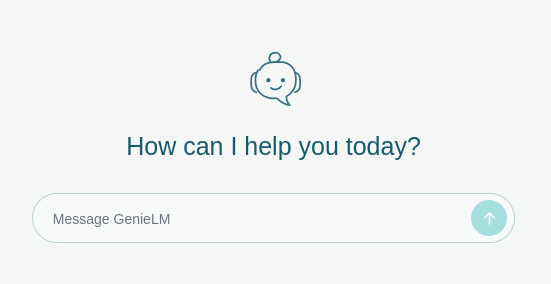

# GenieLM

GenieLM is a small SvelteKit chat client for OpenAI-compatible models and ChatGPT OAuth. It stores conversations in the browser. The app server streams model responses.

<p align="center">
  
</p>

## Features

- Connects to any OpenAI-compatible base URL and model
- Supports ChatGPT access through the community-maintained [openai-oauth](https://github.com/EvanZhouDev/openai-oauth) plugin
- Streams responses and lets you stop generation
- Stores conversations locally and creates an LLM-generated title for each conversation
- Shows Markdown, highlighted code, copy buttons, tables, and KaTeX
- Shares conversations as Markdown
- Copies individual messages
- Reads messages with the browser system voice
- Searches private local documents and saves explicitly requested memories
- Searches the web, checks weather, and runs code in an isolated Linux container
- Supports desktop and mobile devices

<table>
  <tr>
    <td width="50%"></td>
    <td width="50%"></td>
  </tr>
  <tr>
    <td align="center">OpenAI-compatible API</td>
    <td align="center">ChatGPT OAuth</td>
  </tr>
</table>

## Run it

```sh
bun install
bun run sandbox:build       # requires rootless Podman
bun run dev -- --open
```

The code tool runs Python, JavaScript, and shell snippets without network access in a disposable Alpine container. If you do not build the image, the other tools still work.

### Local knowledge

Place the [Xenova multilingual E5 model](https://huggingface.co/Xenova/multilingual-e5-small) in `multilingual-e5-small/`, including `onnx/model_quantized.onnx`. Open **Account → Knowledge** to index `.md` and `.txt` files. The model can also save, update, or forget a `[Memory]` document when you explicitly ask it to. Documents, memories, chunks, and embeddings stay in the ignored local `knowledge.db` file.

Before you send your first message, open the GenieLM menu in the header.

### OpenAI-compatible API

Enter the base URL, model name, and optional API key. Include the API prefix in the base URL, such as `http://localhost:8888/v1`.

### ChatGPT OAuth

1. Select ChatGPT.
2. Select **Sign in with ChatGPT**.

If the browser extension is missing, GenieLM opens its installation page in a new tab.

1. Install the browser extension.
2. Return to GenieLM.
3. Select **Sign in with ChatGPT** again.

The OAuth integration is unofficial and is not affiliated with OpenAI.

## Local data

GenieLM stores conversation history and non-secret provider settings in `localStorage`. It stores custom API keys in `sessionStorage` for the current tab. The OAuth plugin encrypts its browser session in IndexedDB. Private knowledge documents and embeddings stay in the local `knowledge.db` file.

GenieLM escapes raw HTML in model output before it renders Markdown.

## Commands

```sh
bun run dev                 # development server
bun run check               # Svelte and TypeScript checks
bun test src                # tests
bunx eslint src             # lint source files
bun run build               # production build
bun run sandbox:build       # build the local code-execution image
```
